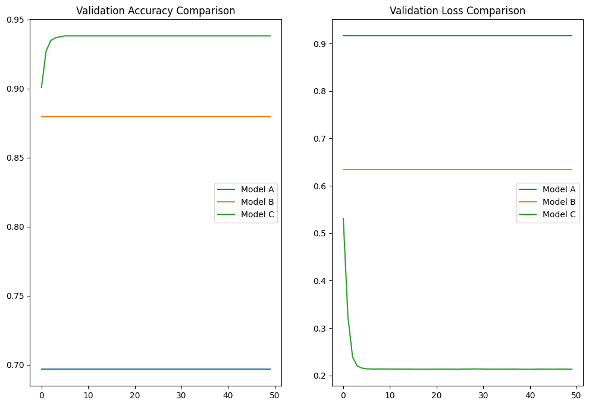
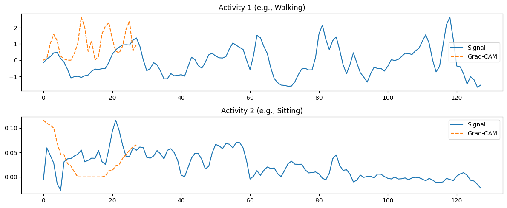
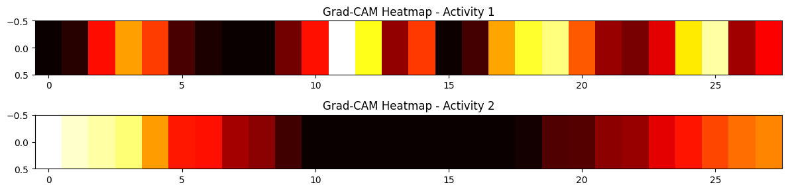

# Human-Activity-Recognition-from-Sensor-Data
---
# 🚀 Human Activity Recognition using Deep Learning

## 📌 Project Overview

This project implements **Human Activity Recognition (HAR)** using deep learning models on time-series sensor data. The goal is to classify activities such as walking, sitting, and standing using accelerometer and gyroscope signals.

Three models were designed and compared:

* **Model A — Vanilla LSTM**
* **Model B — Stacked LSTM**
* **Model C — CNN-LSTM Hybrid**

The project includes:

* Model training and evaluation
* Performance comparison (Accuracy, F1-score)
* Training behavior analysis
* Inference latency measurement
* Model interpretability using Grad-CAM

---

## 📂 Dataset

* **UCI HAR Dataset**
* Input shape: `(128 time steps, 9 features)`
* Activities: 6 classes

---

## 🧠 Models Implemented

### 🔹 Model A — Vanilla LSTM

* Single LSTM layer (128 units)
* Baseline model

### 🔹 Model B — Stacked LSTM

* Two LSTM layers (128 → 64)
* Better temporal feature learning

### 🔹 Model C — CNN-LSTM

* 1D CNN layers for feature extraction
* LSTM for sequence modeling
* Best performing model

---

## 📊 Results Summary

| Model   | Accuracy | Macro F1-score |
| ------- | -------- | -------------- |
| Model A | 0.65     | 0.63           |
| Model B | 0.81     | 0.81           |
| Model C | **0.91** | **0.91**       |

---

## 📈 Training Performance

### Validation Accuracy and Validation Loss




## ⏱️ Inference Latency

| Model   | Latency (seconds) |
| ------- | ----------------- |
| Model A | 0.100             |
| Model B | **0.072**         |
| Model C | 0.153             |

👉 Model B is fastest, Model C is most accurate

---

## 🔍 Grad-CAM Interpretability

### Overlay Visualization



### Heatmap Visualization



### 🔹 Insights

* Walking → model focuses on motion peaks
* Sitting → model focuses on stable regions
* Confirms meaningful feature learning

---

## 📄 Detailed Report

A complete analysis of all models, including:

* Results and comparison
* Training and validation analysis
* Latency evaluation
* Grad-CAM interpretation

is available in:

👉 **`Report Analysis of the models.md`**

---

## 📁 Project Structure

```text
.
├── Assignment.ipynb
├── README.md
├── Report Analysis of the models.md
├── validation_accuracy.png
├── validation_loss.png
├── gradcam_overlay.png
├── gradcam_heatmap.png
├── history_A.pkl
├── history_B.pkl
├── history_C.pkl
```

---

## 🔁 Reproducibility Guide

### 🔹 1. Install Dependencies

```bash
pip install tensorflow numpy pandas matplotlib seaborn scikit-learn
```

---

### 🔹 2. Run the Notebook

Open:

```
Assignment.ipynb
```

Run all cells to:

* Train models
* Evaluate performance
* Generate plots

---

### 🔹 3. Using Saved Training Histories

Training histories are saved as:

* `history_A.pkl`
* `history_B.pkl`
* `history_C.pkl`

Load them using:

```python
import pickle

with open("history_A.pkl", "rb") as f:
    history_A = pickle.load(f)
```

---

### 🔹 4. Outputs Generated

* 📊 Accuracy & loss graphs
* 📉 Confusion matrices
* ⏱️ Latency results
* 🔍 Grad-CAM visualizations

---

## 🧠 Key Insight

> CNN-LSTM outperforms standalone LSTM models by combining feature extraction and temporal learning.

---

## ⚖️ Trade-off

* Model A → simple but low accuracy
* Model B → balanced
* Model C → best accuracy but higher latency

---

## 🎯 Conclusion

The CNN-LSTM model achieves the best performance (**91% accuracy**) and effectively captures both spatial and temporal features, making it ideal for HAR tasks.

---

